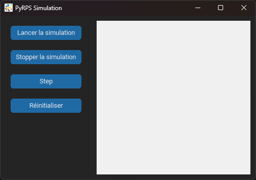

# PyRPS

Une compétition évolutive à base d'IA, de pierres, de feuilles, de ciseaux et d'autres mécanismes intéressants pour déterminer quel camp est le meilleur.

# Installation

Les librairies nécessaires à l'exécution de la simulation sont `CustomTkinter`, `Matplotlib`, `NumPy` et `Pillow`. Elles sont listées dans le fichier `requirements.txt`, l'installation est donc très simple :
```sh
> pip install -r requirements.txt
```
> ⚠️ **Attention**
>
> TkInter doit être installé lors de l'installation de Python


# Simulation

## Configuration

Le fichier de configuration de la simulation est `config.json` :
- `easter_egg` : activer ou non l'easter egg
- `sim` :
    - `delta_time` : temps en millisecondes entre chaque étape de la simulation en temps réel (en plus du temps de calcul)
    - `grid_size` : taille de la carte sur laquelle évoluent les populations
    - `tile_size` : taille d'une case de la carte (et donc d'une entité)
    - `pop_size` : nombre d'entités initialement présentes dans chacune des trois populations
    - `layers` : couches de neuronnes cachées pour les réseaux de neuronnes des entités
    - `data` :
    
        - `speed` : vitesse des entités
        - `damage` : dégâts que peuvent infliger les entités
        - `steal` : énergie que peuvent voler les entités aux entités des autres populations
        - `energy` : énergie initial de l'entité et énergie nécessaire pour se reproduire
        - `loss_factor` : facteur de perte d'énergie au cours du temps pour une entité
        - `vision` : distance à laquelle les entités peuvent voir
        - `range` : distance à laquelle les entités peuvent attaquer
        - `mod_scale` : facteur de mutation des neuronnes lors de la reproduction d'une entité
> ℹ️ **Note**
>
> Les paramètres de `data` (sauf `mod_scale`) sont présents 3 fois pour personnaliser chaque population

## Exécution

Le fichier principal de la simulation est `app.py`. Pour la lancer il suffit donc d'exécuter ce fichier :
```sh
> python app.py
```
> ℹ️ **Note**
>
> La commande pour lancer python peut varier selon votre installation

Cela ouvrira l'interface graphique suivante :



À gauche se trouve un menu permettant de contrôler la simulation tandis que la zone où la simulation est représentée se situe sur la droite.

## Contrôle de la simulation
Les 4 boutons bleus permettent de contrôler la simulation :
- Lancer la simulation : démarre la simulation en temps réel
- Stopper la simulation : met en pause la simulation
- Step : avance la simulation d'une étape
- Réinitialiser : affiche un graphique montrant l'évolution des populations, puis remet à zéro la simulation