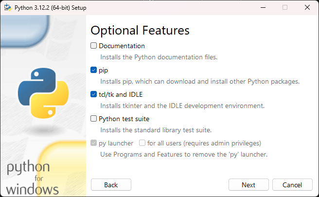

# PyRPS - Trophées NSI

## ⚠ Trophées NSI ⚠

Pour les trophées NSI, merci de télécharger le code [ici](https://github.com/fricht/PyRPS/releases/tag/trophee-nsi).
Version gelée de la date de rendu.

## Description

Une compétition évolutive à base d'intelligence artificielle, de pierres, de papier et de ciseaux qui simule le célèbre jeu à grande échelle pour déterminer quel camp est le meilleur.

## Prérequis

Python version 3.10 ou supérieure est requis pour exécuter l'application. Vous pouvez le télécharger [ici](https://python.org/downloads).

Les dépendances nécessaires au fonctionnement de l'application sont :
- [CustomTkinter](https://customtkinter.tomschimansky.com/)
- [Matplotlib](https://matplotlib.org/)
- [NumPy](https://numpy.org/)
- [Pillow](https://pillow.readthedocs.io/en/stable/)
- [Tkinter](https://docs.python.org/3/library/tkinter.html)

> ⚠️ **Attention**
>
> Tkinter doit être installé lors de l'installation de Python. Voir [ici](#modulenotfounderror-no-module-named-tkinter) si Tkinter n'est pas installé sur votre ordinateur.

## Installation

Les dépendances sont présentes dans le fichier `requirements.txt`, l'installation est donc très simple :
```sh
> pip install -r requirements.txt
```

## Usage

Merci de consulter la [documentation](doc/Documentation.md) pour plus d'informations sur l'utilisation et le fonctionnement de l'application.

## Résolution de problèmes

### ModuleNotFoundError: No module named 'tkinter'

<details>
<summary>Windows</summary>

Sur Windows, Tkinter doit être installé lors de l'installation de Python. Il n'est pas possible d'utiliser `pip` pour installer Tkinter.

Pour installer Tkinter, téléchargez la dernière version l'installateur Python [ici](https://python.org/downloads), puis exécutez-le. Choisissez l'option `Modify` puis cochez `tcl/tk and IDLE` :



Ensuite, cliquez sur `Next` puis `🛡️ Install`.

Tkinter est maintenant installé sur votre ordinateur. Vous pouvez relancer l'application.
</details>

<details>
<summary>Linux</summary>

#### Debian

Pour installer Tkinter sur Debian, exécutez simplement la commande suivante :
```sh
> sudo apt-get install python3-tk
```

Tkinter est maintenant installé sur votre ordinateur. Vous pouvez relancer l'application.

#### Autres distributions Linux

Pour installer Tkinter sur une autre distribution Linux, utilisez votre gestionnaire de paquets. Dans tous les cas, internet est votre ami !

</details>
