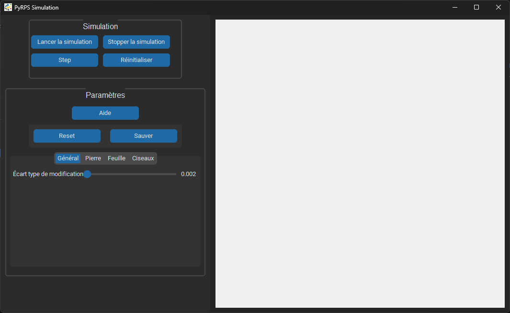

# PyRPS - Trophées NSI

## Description

Une compétition évolutive à base d'intelligence artificielle, de pierres, de papier et de ciseaux qui simule le célèbre jeu à grande échelle pour déterminer quel camp est le meilleur.

## Prérequis

Python est requis pour éxecuter l'application. Vous pouvez le télécharger [ici](https://python.org/downloads).

Les dépendances nécessaires au fonctionnement de l'application sont :
- [CustomTkinter](https://customtkinter.tomschimansky.com/)
- [Matplotlib](https://matplotlib.org/)
- [NumPy](https://numpy.org/)
- [Pillow](https://pillow.readthedocs.io/en/stable/)
- [Tkinter](https://docs.python.org/3/library/tkinter.html)

> ⚠️ **Attention**
>
> Tkinter doit être installé lors de l'installation de Python. Voir [ici](#modulenotfounderror-no-module-named-tkinter) si Tkinter n'est pas installé sur votre ordinateur.

## Installation

Les dépendances sont présentes dans le fichier `requirements.txt`, l'installation est donc très simple :
```sh
> pip install -r requirements.txt
```

## Usage

Pour lancer l'application, exécutez le fichier `app.py` dans le dossier `sources` :
```sh
> python sources/app.py
```

Cela ouvrira l'interface graphique suivante :



Cette interface se structure en deux parties :
- A gauche se situe le menu permettant de contrôler la simulation et d'en changer les paramètres
- A droite se trouve la carte où la simulation est représentée

Le sous-menu `Simulation` permet de contrôler l'état de la simulation à l'aide des 4 boutons :
- `Lancer la simulation` : démarre la simulation en temps réel
- `Stopper la simulation` : met en pause la simulation
- `Step` : avance la simulation d'une étape
- `Réinitialiser` : affiche un graphique montrant l'évolution des populations, puis remet à zéro la simulation

Le sous-menu `Paramètre` permet de modifier les différents paramètres de la simulation :
- `Aide` : affiche de l'aide à propos des différents paramètres
- `Reset` : réinitialise les paramètres aux derniers sauvegardés en mémoire
- `Sauver` : sauvegarde les paramètres en mémoire
- `Ecart type de modification` : facteur de mutation du réseau de neuronnes lors de la reproduction d'une entité
- `Population` : nombre d'entités initialement présentes dans chaque population
- `Vitesse` : vitesse de déplacement des entités (recommandé à 1 pour une meilleure expérience visuelle)
- `Dégâts` : dégâts que peuvent infliger les entités à leurs proies
- `Vol d'énergie` : énergie récupérée par les entités après une attaque
- `Energie de naissance` : énergie possédé par une entité lors de sa création
- `Energie pour reproduction` : énergie nécessaire à une entité pour se reproduire
- `Facteur de vieillissement` : vitesse à laquelle les entités perdent de l'énergie
- `Vision` : distance à laquelle peuvent voir les entités
- `Portée` : distance à laquelle les entités peuvent attaquer

## Résolution de problèmes

### ModuleNotFoundError: No module named 'tkinter'

<details>
<summary>Windows</summary>

Sur Windows, Tkinter doit être installé lors de l'installation de Python. Il n'est pas possible d'utiliser `pip` pour installer Tkinter.

Pour installer Tkinter, téléchargez la dernière version l'installateur Python [ici](https://python.org/downloads), puis exécutez-le. Choisissez l'option `Modify` puis cochez `tcl/tk and IDLE` :


Ensuite, cliquez sur `Next` puis `🛡️ Install`.

Tkinter est maintenant installé sur votre ordinateur. Vous pouvez relancer l'application.
</details>

<details>
<summary>Linux</summary>

Pour installer Tkinter sur Linux, exécutez simplement la commande suivante :
```sh
> sudo apt-get install python3-tk
```

Tkinter est maintenant installé sur votre ordinateur. Vous pouvez relancer l'application.
</details>
