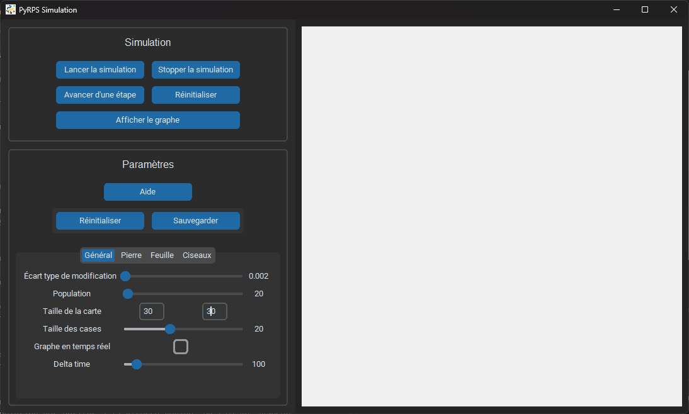
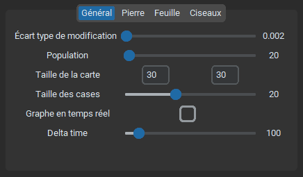

# Documentation de PyRPS <!-- omit from toc -->

## Table des matières <!-- omit from toc -->
1. [Utilisation de l'application](#utilisation-de-lapplication)
   1. [Interface](#interface)
   2. [Contrôle de la simulation](#contrôle-de-la-simulation)
   3. [Paramètres de la simulation](#paramètres-de-la-simulation)
      1. [Aide](#aide)
      2. [Gestion de l'état des paramètres](#gestion-de-létat-des-paramètres)
      3. [Paramètres généraux](#paramètres-généraux)
      4. [Paramètres des populations](#paramètres-des-populations)
2. [Fonctionnement de la simulation](#fonctionnement-de-la-simulation)
   1. [Principe général](#principe-général)
   2. [La carte](#la-carte)
   3. [Les entités](#les-entités)
3. [Exemples](#exemples)


# Utilisation de l'application

## Interface

Pour lancer l'application, exécutez le fichier `app.py` dans le dossier `sources` :
```sh
> python sources/app.py
```

> ℹ **Note**
>
> La commande `python` peut être différente selon votre système. Vous pouvez utiliser `python3` ou `py` à la place.

Cela ouvrira l'interface graphique suivante :



Cette interface se structure en deux parties :
- A gauche se situe le menu permettant de contrôler la simulation et d'en changer les paramètres.
- A droite se trouve la carte où la simulation est représentée.


## Contrôle de la simulation

Le menu `Simulation` permet de contrôler la simulation à l'aide de 5 boutons :

-  : Démarre/reprend la simulation en temps réel. Si le bouton `Réinitialiser` a été cliqué, cela efface les logs de la simulation précédente puis lance une nouvelle simulation avec les paramètres actuels, définis dans le menu `Paramètres` (voir [section suivante](#paramètres-de-la-simulation)). Sinon, cela continue la simulation mise en pause.

-  : Met en pause la simulation en temps réel, si elle est en cours. Dans le cas contraire, cela n'a aucun effet.

-  : Avance la simulation d'une étape. Cela permet de suivre précisement l'évolution des entités à la vitesse voulue, en faisant avancer la simulation d'une étape à chaque clic.

-  : Remet à zéro la simulation. Cela efface toutes les entités de la carte. Les logs de la dernière simulation sont toujours en mémoire et peuvent être visualisés jusqu'à ce qu'une nouvelle simulation soit lancée.

-  : Affiche un graphique montrant l'évolution des populations au cours du temps. Cela fonctionne même si la simulation en lancée en temps réel, et affiche dans ce cas là les logs jusqu'au moment où le bouton a été cliqué.


## Paramètres de la simulation

### Aide


Le bouton d'aide ouvre une fenêtre d'aide contenant des informations sur tous les paramètres, notamment comment ils affectent la simulation.

> ℹ **Note**
>
> Lorsque le menu d'aide est ouvert, la fenêtre principale de l'application n'est pas utilisable. Pour pouvoir l'utiliser, il faut fermer la fenêtre d'aide.

### Gestion de l'état des paramètres


Ces deux boutons permettent de gérer l'état des paramètres en mémoire. Imaginons que vous avez trouvé des paramètres de simulation qui vous paraissent plutôt satisfaisants, mais que vous sentez que vous pouvez faire encore mieux. Vous voulez faire des modifications, mais sans prendre le risque de perdre ces paramètres que vous avez trouvé. Ces boutons servent à cela : modifiez un paramètre puis lancer une simulation. Si ce changement vous convient, appuyez sur `Sauvegarder`. Sinon, cliquez sur `Réinitialiser` pour revenir à la dernière sauvegarde.

### Paramètres généraux



Ces paramètres modifient la configuration générale de la simulation :

- `Ecart type de modification` : Défini le facteur de mutation du réseau de neurones d'une entité lorsqu'elle se reproduit. Cela contrôle à quel point les enfants sont différents de leur parent.

- `Population` : Défini le nombre d'entités initialement présentes dans chaque population. Le nombre total d'entités au début d'une simulation est donc ce paramètre multiplié par 3. L'augmentation de ce paramètre à un fort impact sur les performances de la simulation en temps réel.

- `Taile de la carte` : Défini les dimensions X et Y de la carte pour la prochaine simulation.

- `Taille des cases` : Défini la taille des entités sur la carte. Pour une même taille de carte, une plus grande taille des cases augmente la taille du caneva.

- `Graphe en temps réel` : Active ou désactive la mise à jour en temps réel du graphe durant la simulation. Ce paramètre est appliqué instantanément (pas besoin de recommencer une simulation).

- `Delta time` : Défini le temps minimum entre chaque étape de la simulation. Plus ce paramètre est élevé, plus la simulation est lente. Ce paramètre est appliqué instantanément (pas besoin de recommencer une simulation).

### Paramètres des populations


Ces paramètres modifient les caractéristiques des entités de chaque population. Chaque population possède les mêmes paramètres, mais ils peuvent avoir des valeurs différentes :

- `Vitesse` : Contrôle la vitesse de déplacement des entités, jusqu'à combien de cases elles peuvent se déplacer lors de chaque étape (recommandé à 1 pour une meilleure expérience visuelle, le suivi d'une entité étant plus facile).

- `Dégâts` : Défini les dégâts maximaux que peuvent infliger les entités à leur proie lors d'une attaque. Une attaque réduit l'énergie de la proie de `Dégâts`.

- `Vol d'énergie` : Défini la capacité des entités à récupérer de l'énergie après une attaque. L'énergie récupérée est égale à `Vol d'énergie` multiplié par `Dégâts`.

- `Energie de naissance` : Défini l'énergie possédé par une entité lors de sa création. Lorsque l'énergie d'une entité tombe à 0, elle meurt.

- `Energie pour reproduction` : Défini l'énergie nécessaire à une entité pour se reproduire. Lorsqu'une entité se reproduit, elle perd cette quantité d'énergie, et un enfant est créé avec une énergie égale à `Energie de naissance`.

- `Facteur de vieillissement` : Défini la vitesse à laquelle les entités perdent naturellement de l'énergie au cours du temps. Plus ce paramètre est élevé, plus les entités vieillissent rapidement.

- `Vision` : Défini la distance à laquelle peuvent voir les entités. Cela affecte leur capacité à détecter les autres entités et à les attaquer.

- `Portée` : Défini la distance à laquelle les entités peuvent attaquer.


# Fonctionnement de la simulation

## Principe général

Le but premier de cette simulation est de mettre en avant la complexité de simples réseaux de neurones grâce à de mutliples entités interagissant entre elles, et de montrer l'évolution au travers de la sélection naturelle.

Cette simulation comporte 3 populations différentes qui possède chacune une population prédatrice et une population proie. Le but de chaque populations est alors de dominer la carte en éliminant toutes ses proies, tout en évitant d'être éliminée par ses prédateurs.

## La carte

La simulation se déroule sur une carte rectangulaire topologiquement assimilable à un tore, c'est à dire que les entités qui sortent d'un côté de la carte réapparaissent de l'autre côté. Cette carte est divisé en cases, et chaque case ne peut contenir qu'une seule entité.

Les dimensions de la carte ainsi que la taille des cases sont définies dans les [paramètres généraux](#paramètres-généraux) de la simulation.

## Les entités

Les entités appartiennent à l'une des trois populations, les pierres, les feuilles ou les ciseaux. Les pierres sont prédateurs des ciseaux, les ciseaux sont prédateurs des feuilles, et les feuilles sont prédateurs des pierres :


Chaque entité possède des caractéristiques lui permettant d'évoluer dans son environnement et de s'adapter à celui-ci et aux autres entités.

L'énergie d'une entité représente à la fois sa santé et sa capacité à se reproduire. Au début de la simulation et lorsqu'elles naissent, les entités possèdent une quantité d'énergie initiale en fonction du [paramètre `Energie de naissance`](#paramètres-des-populations). Lorsque l'énergie d'une entité tombe à 0, elle meurt. L'énergie se perd naturellement au cours du temps mais aussi lors de la reproduction, le seul moyen d'en récupérer est d'attaquer une proie pour lui en voler. Une entité peut donc perdre de l'énergie si elle se fait attaquer.

Les 3 actions possibles pour une entité sont se déplacer, attaquer ou se reproduire. La direction et la vitesse de déplacement d'une entité sont déterminées par son réseau de neurones, et limitées par le [paramètre `Vitesse`](#paramètres-des-populations). L'action d'attaquer une proie est aussi décidée par le réseau de neurones, mais n'est réalisable que si une proie est à [portée](#paramètres-des-populations). Enfin, l'action de se reproduire, qui est automatiquement déclenchée si l'énergie de l'entité est suffisante, crée un enfant sur une case vide [visible par l'entitée](#paramètres-des-populations) avec une énergie égale à [l'énergie de naissance](#paramètres-des-populations).

Le centre de décision des entités et le principal intérêt de cette simulation est le réseau de neurones. Chaque entité en possède un qui lui permet de faire les choix de déplacement et d'attaque en fonction de son âge (nombre d'étapes de simulation écoulées depuis sa naissance), de son énergie et de sa vision. Lors de la reproduction, le réseau de neurones de l'enfant est une mutation du réseau de neurones du parent, avec un facteur de mutation défini par le [paramètre `Ecart type de modification`](#paramètres-généraux). Cela permet de simuler les mutations génétique menant à l'évolution par sélection naturelle : les entités les plus adaptées à leur environnement et faisant les meilleurs choix survivent et transmettent leur « intelligence » à leur descendance.

# Exemples

Si jamais vous n'arriver pas à obtenir de simulation intéressante, voici des exemples de graphes présentant des évolution interessantes :


